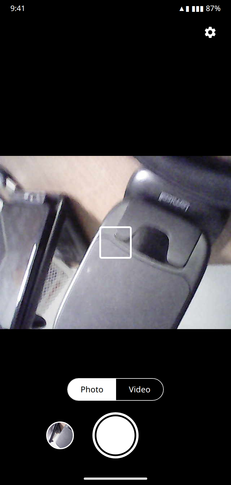
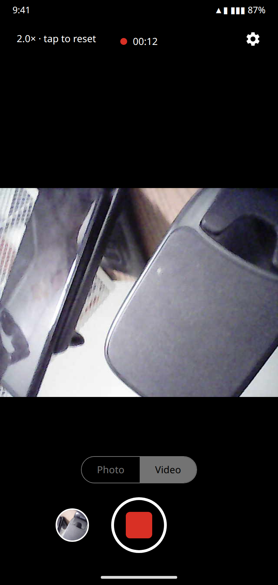
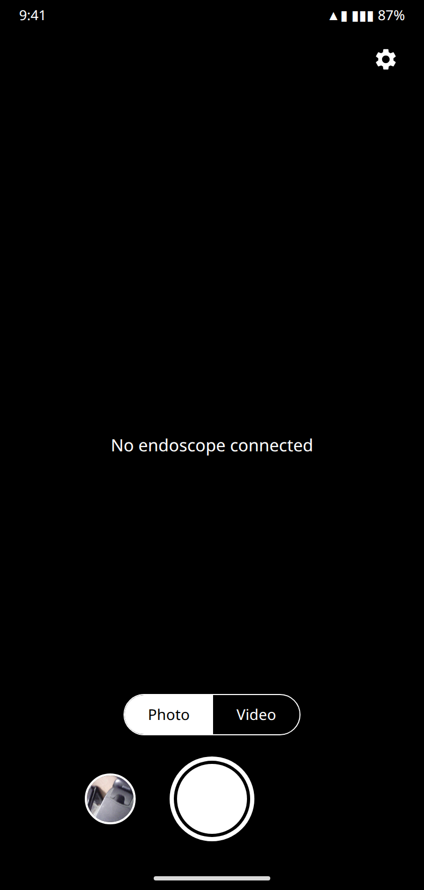
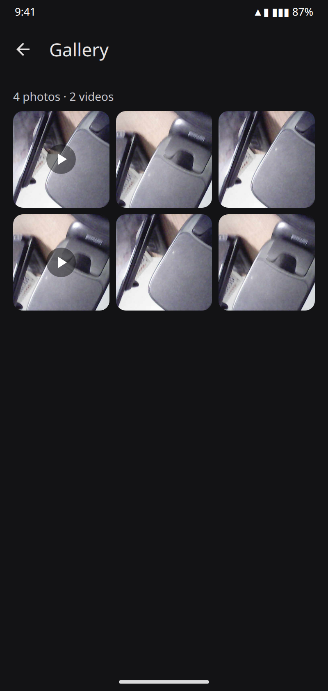
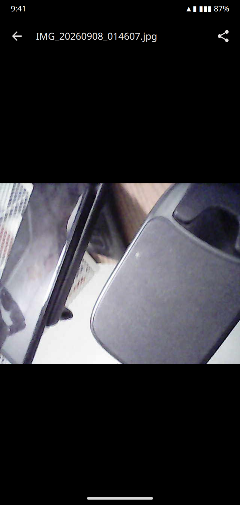
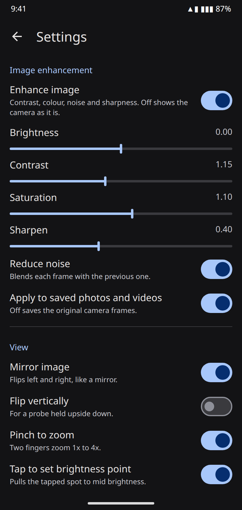

<p align="center">
  
</p>

<h1 align="center">EndoCam</h1>

<p align="center">Android camera app for cheap USB endoscopes. Plug the probe into the phone, see the picture, take photos and record video.</p>

EndoCam talks to the Geek szitman "supercamera" chip found in low-cost USB endoscopes over USB OTG. The vendor app only supports its own protocol. EndoCam is a clean-room Kotlin port of the Linux tool in [EndoscopeCamera](https://github.com/snehesht/EndoscopeCamera), with a Material 3 user interface. No root, no NDK, no libusb.

## Features

- Live view at 640×480, the real resolution of these cameras
- Photo and video modes with one shutter, like a phone camera
- MP4 H.264 video recording
- Hardware button on the probe: one press takes a photo, two presses start or stop a recording
- Image enhancement: contrast, saturation, sharpen, noise reduction, all with off switches
- Pinch to zoom, tap to set the brightness point
- Mirror and vertical flip
- Gallery with preview and share
- Works in portrait and landscape
- Files stay in the app's private folder. Uninstall removes them.

## Screenshots

Rendered previews of the screens. Replace them with real captures from your phone with the command in [Update the screenshots](#update-the-screenshots).

| Camera, photo mode | Recording, zoomed | No camera plugged in |
|---|---|---|
|  |  |  |

| Gallery | Preview and share | Settings |
|---|---|---|
|  |  |  |

## Requirements

- Android 10 or later
- A phone with USB host support, also called USB OTG
- A USB-C adapter or cable for the endoscope
- A supported endoscope, see [COMPATIBILITY.md](COMPATIBILITY.md)

iPhone is not supported. iOS gives apps no access to USB devices of this kind.

## Install

Download the release APK from the Releases page, or build it with the steps below. Then:

```
adb install -r app-release.apk
```

## Use

1. Plug the endoscope into the phone. Android asks "Open EndoCam?". Accept.
2. The live picture appears. Turn the light dial on the cable to set brightness.
3. Tap the shutter to take a photo. Switch to Video and tap the shutter to record. Tap again to stop.
4. Tap the round thumbnail to open the gallery. Open an item and tap Share to send it to another app.
5. Tap the gear to open Settings.

Hardware button on the probe:

| Press | Not recording | Recording |
|---|---|---|
| One press | Take a photo | Take a photo, recording continues |
| Two presses | Start recording | Stop recording |
| Hold | Camera firmware switches the lens | Same |

Gestures on the live picture:

| Gesture | Effect |
|---|---|
| Pinch | Zoom 1x to 4x. Drag to move. Tap the zoom chip to reset. |
| Tap | Sets a brightness point. The spot under the finger is pulled to mid brightness. Tap the same spot to clear. |

The lens has a fixed focus. Hold the probe 3 to 8 cm from the subject for a sharp picture.

## Settings

| Setting | Default | What it does |
|---|---|---|
| Enhance image | On | Master switch for contrast, saturation, sharpen and noise reduction |
| Apply to saved photos and videos | On | Off saves the untouched camera frames |
| Mirror image | On | Flips left and right |
| Flip vertically | Off | Flips top and bottom |
| Pinch to zoom | On | Digital zoom |
| Tap to set brightness point | On | Tap to expose |
| USB commands | Built-in values | Bytes sent to the camera at start. For testing a command captured from the vendor app. |

## Where files go

Photos and videos are written to the app's private folder on the phone:

```
Android/data/net.snehesh.endocam/files/Pictures/IMG_yyyyMMdd_HHmmss.jpg
Android/data/net.snehesh.endocam/files/Movies/VID_yyyyMMdd_HHmmss.mp4
```

Use Share in the app to copy a file out. Uninstalling the app removes the folder.

## Build

Requirements: JDK 17 or 21, Android SDK with platform 35. Android Studio installs both.

```
git clone https://github.com/snehesht/EndoCam.git
cd EndoCam
./gradlew :app:testDebugUnitTest
./gradlew :app:assembleDebug
adb install -r app/build/outputs/apk/debug/app-debug.apk
```

Release build, shrunk with R8:

```
./gradlew :app:assembleRelease
```

Without a `keystore.properties` file in the project root the release APK is signed with the debug key. To sign with your own key, create that file:

```
storeFile=/path/to/release.jks
storePassword=...
keyAlias=...
keyPassword=...
```

Do not commit it.

### Update the screenshots

With the phone connected and the app open on each screen:

```
adb exec-out screencap -p > docs/screenshots/01-camera-photo.png
```

Repeat for the other file names in `docs/screenshots`.

## How it works

- `UsbCamera.kt` opens the device with `android.hardware.usb`, claims interfaces 0 and 1, selects alternate setting 1, sends the two start commands and reads 1024 byte packets from endpoint 0x81.
- `PacketParser.kt` reassembles the JPEG frames from the packets and reports the button state. Packet layout is documented in the source.
- `FrameProcessor.kt` applies the enhancement, zoom and flip on a separate thread.
- `Mp4Recorder.kt` encodes video with MediaCodec through a Surface and writes MP4 with MediaMuxer.
- `MainActivity.kt`, `Gallery.kt` and `Settings.kt` are the Jetpack Compose screens.

Debug log:

```
adb logcat -s EndoCam
```

The log shows each USB init step, frames per second and dropped frames every 5 seconds.

## Known limits

- 640×480 is the camera's real resolution. The box may claim more.
- The light is a dial on the cable. The app cannot switch it.
- Fixed focus lens.
- Only one client can hold the USB device. Close the desktop tool before opening the app.

## License

MIT. See [LICENSE](LICENSE).
